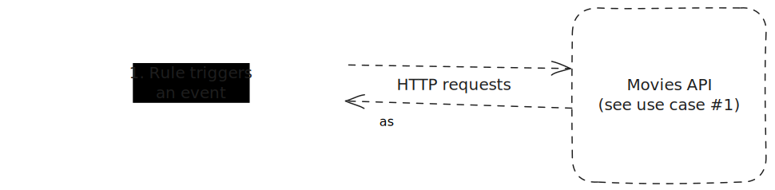
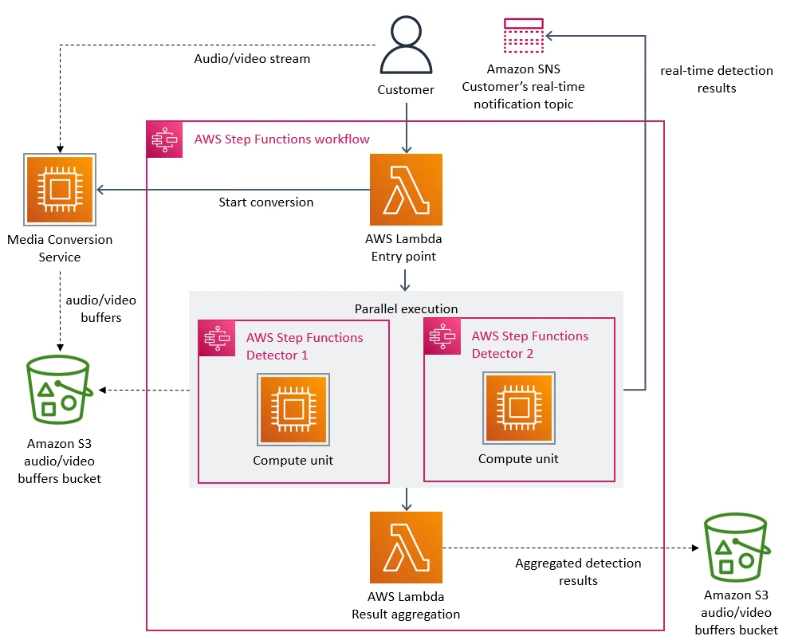

## What is Lambda?
### According to AWS:
- Run code without provisioning or managing servers, creating workload-aware cluster scaling logic, maintaining event integrations, or managing runtimes. 
- Run code for virtually any type of application or backend service. Just upload your code as a ZIP file or container image, and Lambda automatically allocates compute execution power and runs your code based on the incoming request or event, for any scale of traffic.
- Write Lambda functions in your favorite language (Node.js, Python, Go, Java, and more) and use both serverless and container tools, such as AWS SAM or Docker CLI, to build, test, and deploy your functions

### Typical use cases:
- web applications, hosting APIs
- preprocessing unstructured/"dirty" data for later use in Machine Learning pipelines
- serving already trained Machine Learning models
- automating workflows based on events

## "Serverless"
### Limitations:
- hard(cannot be adjusted):
    - can only run up to 15 minutes, unsuited for longer running tasks
    - can take only up to 6MB of payload, for example: a single HTTP request with around of 6MB worth of data
    - ephemeral storage - only up to 10GB(512MB by default)
    - code bundle size: 50MB for compressed packages, 250MB for uncompressed packages
- soft(can be adjusted by AWS):
    - 1000 parallel executions

### Other issues:
- cold starts - it takes time to provision a new microVM for runtime execution. Interpreted languages(JavaScript, Python) and languages with specific runtimes(Java, C#) have longer cold starts because the image of the microVM is larger. Compiled languages(C++, Go, Rust) don't suffer from this downside. FYI: Rust compiled for ARM architecture is the cheapest option for running workloads on AWS Lambda(because of the lowest memory usage)
- bundling dependencies for interpreted languages. Outside of the standard libraries and a select few dependencies all 3rd party software has to bundled in the deployment package.
- vendor lock-in - software developed for Lambda specifically requires both architecture-level and code-level decisions. Porting to other platforms can prove hard or impossible.

### Trivia:
Lambda uses fast virtualization software called [Firecracker](https://firecracker-microvm.github.io/)

## Use cases
Go to ./Technical\_University\_Of\_Lodz\_25.01.2024\_AWS\_Lambda/deploy to see the source code for both use cases.
### Use case \#1 - a simple API served by Lambda


In order to test the provisioned API use the following commands:
```sh
export API_URL="..." // see ./Technical_University_Of_Lodz_25.01.2024_AWS_Lambda/deploy/README.md to get the API_URL
curl -X POST $API_URL/movies -H "Content-Type: application/json" -d '{ "title": "The Godfather", "year": 1969 }'
curl -X GET $API_URL/movies | jq | grep Godfather
```
### Use case \#2 - canary monitoring for the provisioned API with Lambda running the client
What is canary monitoring? Sources:
- [Part 1](https://medium.com/@mareksmigielski/canary-monitoring-part-1-71d318bfe91a)
- [Part 2](https://medium.com/@mareksmigielski/canary-monitoring-part-2-34ca6aed2a54)



## The prime video antipattern
[Original article](https://www.primevideotech.com/video-streaming/scaling-up-the-prime-video-audio-video-monitoring-service-and-reducing-costs-by-90)


The aforementioned restrictions clearly indicate that any file I/O heavy workload is unsuited for Lambda. To circumvent this the Prime Video team use S3 as an intermediate storage for images and this resulted in a massive ammount of read and write operations, causing very high costs.

## Unmentioned sources: 
- [Lambda quotas](https://docs.aws.amazon.com/lambda/latest/dg/gettingstarted-limits.html)
- [Lambda marketing notes](https://aws.amazon.com/pm/lambda/)
